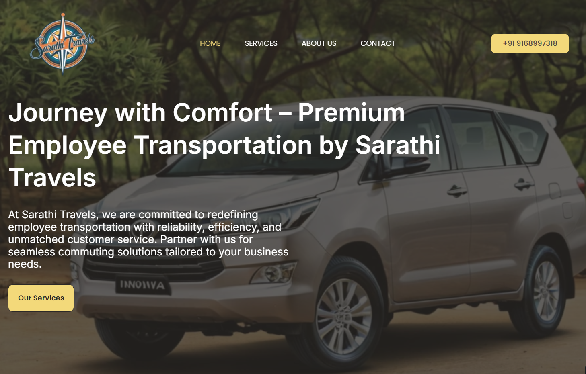

# Sarathi Travel

**Client:** Sarathi Travel  
**Website:** [sarathitravel.in](https://sarathitravel.in)  
**Industry:** Travel & Employee Transportation  
**Technology Stack:** PHP, MySQL, WordPress, WooCommerce, Elementor, Astra Theme  

---

### 📝 Overview

Sarathi Travel is a reputable brand in employee transport services, known for reliability, efficiency, and exceptional customer service. As the client base expanded and corporate offerings diversified, Sarathi needed a strong digital presence to reflect its professionalism and facilitate client engagement.

Smartscripts partnered with Sarathi Travel to build a modern, user-friendly website that reflects the brand’s dedication to seamless and dependable commuting experiences.

---
### 🎯 Objectives

- Build a professional, visually engaging website tailored for the B2B transport industry.  
- Clearly present Sarathi’s services to corporate clients.  
- Ensure smooth navigation and quick access to critical information.  
- Integrate **WooCommerce** for future online service bookings and payments.  
- Deliver a responsive and fast-loading experience on all devices.  

---
### ⚠️ Challenges

Despite a solid business model, Sarathi Travel lacked an online presence that matched its professional standards. The primary challenge was **design**—creating a structure that was modern, intuitive, and optimized for conversion, while also appealing to corporate decision-makers.

Another key challenge was ensuring a seamless balance between visual appeal and functional clarity—especially in areas such as service booking, contact pathways, and user flow.

---
### 💡 Our Solution

To address the challenges and fulfill project goals, we developed a tailored solution using:

- **WordPress CMS** for easy content management.  
- **Astra Theme + Elementor** for a minimal and modern UI, allowing for full customization.  
- **WooCommerce Integration** to support future service booking and payment features.  
- **PHP + MySQL** backend for secure and stable performance.  
- **Mobile-Responsive Design** to ensure a smooth experience across all device types.  

The homepage was structured to showcase Sarathi's offerings, while dedicated service pages were built to highlight key features, benefits, and strong calls-to-action (CTAs).

---
### 🚀 Results

- ✅ **Professional Online Presence**: A sleek, corporate-ready design that builds credibility and trust.  
- ✅ **Enhanced User Engagement**: Visitors can quickly find information on services, partnerships, and contact options.  
- ✅ **Future-Ready Architecture**: WooCommerce foundation ensures scalability for online transactions as the business evolves.  
- ✅ **Fully Responsive Design**: Optimized for desktops, tablets, and smartphones.  

